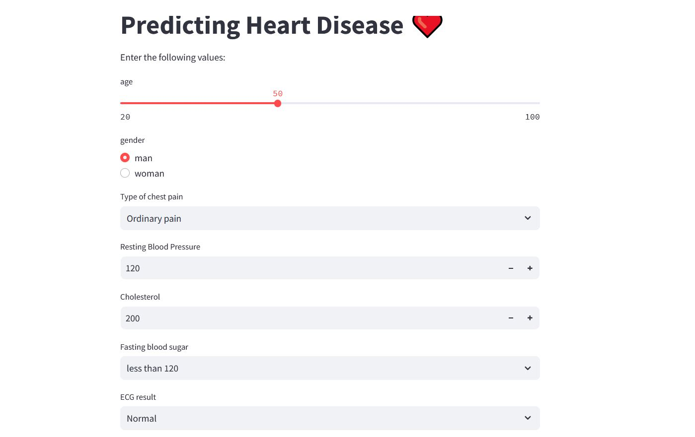

# Heart Disease Predictor

🎯 Project goal: Predicting the likelihood of heart disease based on patients’ medical attributes using machine learning models and provide an interactive Streamlit dashboard for end-users. 

Dataset: https://archive.ics.uci.edu/dataset/45/heart+disease  
Result: https://hdpredictor.streamlit.app


## 🔧 Tools & Libraries

- Python (Pandas, Scikit-learn, Streamlit, XGBoost)
- Excel
- streamlit Cloud
- GitHub for version control


## 📊 Project Workflow

1. **Data Preprocessing & Cleaning**
2. **Statistical & Visual Analysis**
3. **Feature Engineering**
4. **Modeling with XGBoost and Logistic Regression**
5. **Model Interpretation with SHAP**
6. **Interactive Dashboard with Streamlit**
7. **Deployment on GitHub & Streamlit Cloud**


## 🚀 Outputs

- 🌐 Streamlit App → app/app_heart_disease.py
- 📋 Data Analysis & Modeling → Jupyter Notebook

## 💡 Key Features

✅ Predicting heart disease probability based on 13 medical attributes
✅ Model interpretability with SHAP values
✅ Fully interactive dashboard designed for non-technical users


## 🎯Run the Streamlit App

```bash
pip install -r app/requirements.txt
streamlit run app/app_heart_disease.py
 ```

### 🌐 Online App

[Streamlit Cloud Deployment](https://hdpredictor.streamlit.app/)  


## 📁 Project Structure
```bash
heart-disease-predictor/
│
├── 📁 data/
│   └── heart_disease.csv            # Raw dataset
│
├── 📁 notebook/
│   └── HDpredictor.ipynb            # Data analysis & modeling
│
├── 📁 app/
│   └── app_heart_disease.py         # Streamlit app
│   └── requirements.txt             # Dependencies
│   └── heart_disease_model.pkl      # Trained ML model
│   └── scaler.pkl                   # Data scaler
│   └── feature_order.pkl            # Feature ordering
│  
│
├── 📁 dashboard/
│   └── dashboard-screenshot.png     # Final dashboard screenshot   
│
├── 📄 README.md                     # Project documentation
```

## 🧑‍💻 Developer

This project was developed by a data analysis and machine learning enthusiast with the goal of:

- Gaining practical experience in medical data modeling
- Building a professional portfolio project
- Practicing deployment of ML models in real-world apps

